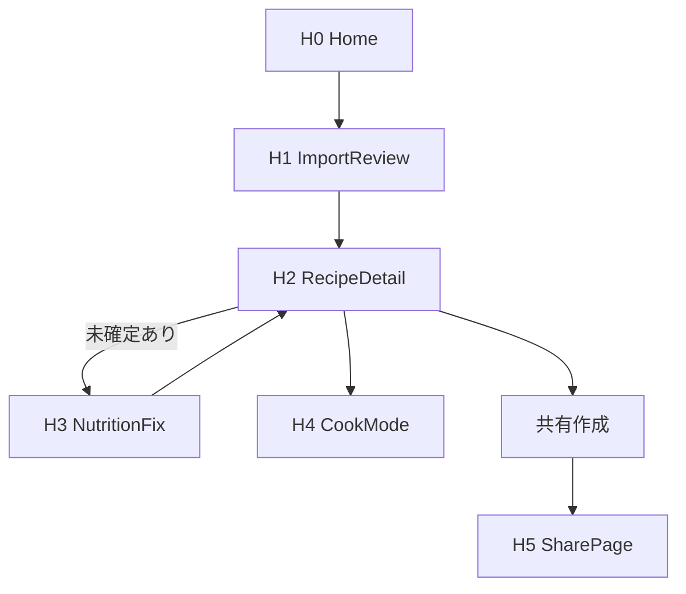

# 03 Screen Flow

## 主要画面
- H0: Home (`/`)
- H1: ImportReview (`/import/review`)
- H2: RecipeDetail (`/recipes/[id]`)
- H3: NutritionFix (`/recipes/[id]/nutrition-fix`)
- H4: CookMode (`/recipes/[id]/cook`)
- H5: SharePage (`/s/[slug]`)

## メイン遷移

```

## 失敗時遷移
- import失敗: H1で再試行/URL編集
- nutrition失敗: H2でbest-effort表示 + 再計算
- share失敗: H2でエラー通知 + 再実行

## 状態遷移（ImportReview）
- idle -> validating -> importing -> success | error

## 状態遷移（NutritionFix）
- idle -> loadingCandidates -> editing -> saving -> next | done
