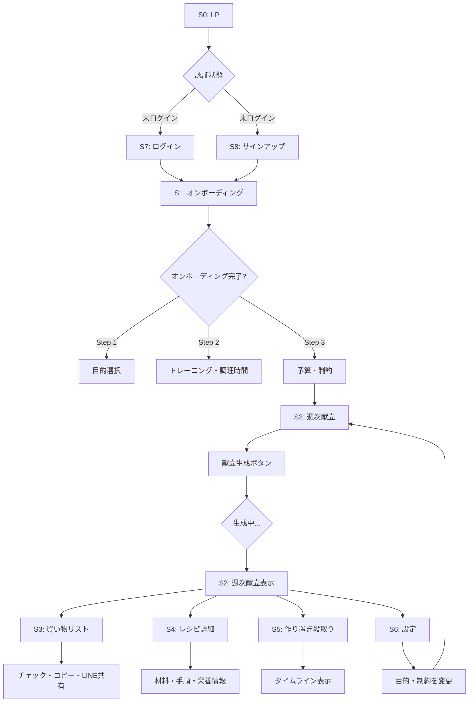
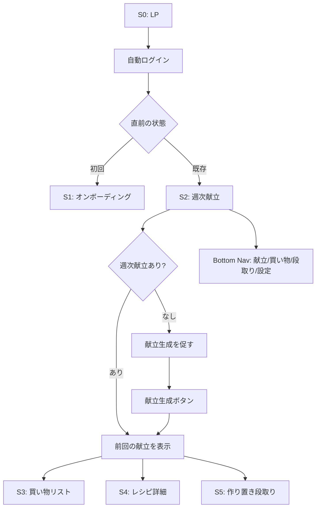
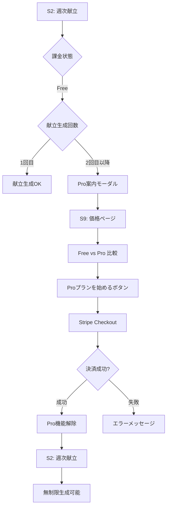
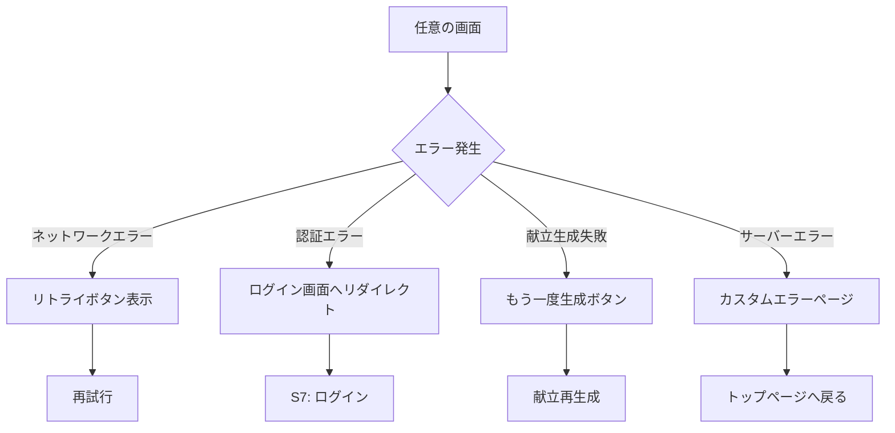
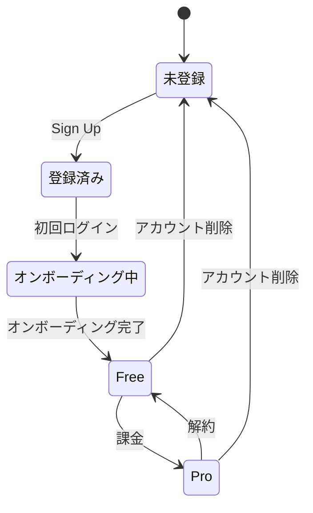
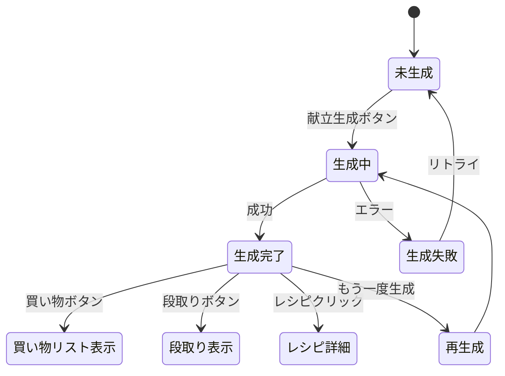
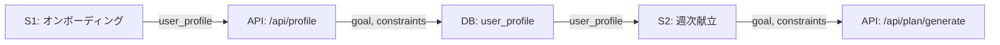

# BulkCart 画面フロー設計書

**作成日**: 2026年2月18日  
**バージョン**: 1.0

---

## 目次

1. [画面一覧](#画面一覧)
2. [画面遷移図](#画面遷移図)
3. [状態遷移](#状態遷移)
4. [ナビゲーション構造](#ナビゲーション構造)

---

## 画面一覧

### 主要画面（7画面）

| ID | 画面名 | パス | 認証 | 優先度 |
|---|---|---|---|---|
| S0 | ランディングページ（LP） | `/` | 不要 | P0 |
| S1 | オンボーディング | `/onboarding` | 必要 | P0 |
| S2 | 週次献立 | `/plan/[week]` | 必要 | P0 |
| S3 | 買い物リスト | `/plan/[week]/grocery` | 必要 | P0 |
| S4 | レシピ詳細 | `/recipes/[id]` | 必要 | P0 |
| S5 | 作り置き段取り | `/plan/[week]/prep` | 必要 | P0 |
| S6 | 設定 | `/settings` | 必要 | P0 |

### サブ画面

| ID | 画面名 | パス | 認証 | 優先度 |
|---|---|---|---|---|
| S7 | ログイン | `/login` | 不要 | P0 |
| S8 | サインアップ | `/signup` | 不要 | P0 |
| S9 | 価格ページ | `/pricing` | 不要 | P0 |
| S10 | マイページ | `/account` | 必要 | P1 |
| S11 | プライバシーポリシー | `/legal/privacy` | 不要 | P1 |
| S12 | 利用規約 | `/legal/terms` | 不要 | P1 |

---

## 画面遷移図

### メインフロー（初回ユーザー）



### リピートユーザーフロー



### 課金フロー



### エラーハンドリングフロー



---

## 状態遷移

### ユーザーライフサイクル



### 献立生成状態



---

## ナビゲーション構造

### Bottom Navigation（認証後）

モバイル優先設計で、主要4画面へのアクセスを提供：

```
┌─────────────────────────────────────┐
│  🍱      🛒      📋      ⚙️       │
│ 献立    買い物   段取り   設定      │
└─────────────────────────────────────┘
```

| アイコン | ラベル | 遷移先 | 説明 |
|---|---|---|---|
| 🍱 | 献立 | `/plan/[week]` | 週次献立画面 |
| 🛒 | 買い物 | `/plan/[week]/grocery` | 買い物リスト |
| 📋 | 段取り | `/plan/[week]/prep` | 作り置き段取り |
| ⚙️ | 設定 | `/settings` | 設定・プロフィール |

### Header（全画面共通）

```
┌─────────────────────────────────────┐
│ BulkCart        [Pro]  👤          │
└─────────────────────────────────────┘
```

- **左**: ロゴ（タップでトップへ）
- **中央**: 課金状態バッジ（Free/Pro）
- **右**: ユーザーメニュー（ドロップダウン）
  - マイページ
  - 設定
  - ログアウト

### Breadcrumb（デスクトップ）

デスクトップ版ではBreadcrumbを表示：

```
BulkCart > 献立 > 2月第3週 > 買い物リスト
```

---

## 画面間のデータフロー

### 献立生成 → 買い物リスト

```mermaid
flowchart LR
  A[S2: 週次献立] -->|plan_id| B[API: /api/plan/generate]
  B -->|plan_items| C[DB: plans + plan_items]
  C -->|plan_id| D[API: /api/plan/[id]/grocery]
  D -->|grocery_items| E[S3: 買い物リスト]
```

### オンボーディング → 献立生成



---

## 画面別の重要状態

### S0: ランディングページ

**状態**:
- `isAuthenticated: boolean` - ログイン済みかどうか
- `scrollPosition: number` - スクロール位置（CTA表示制御）

**アクション**:
- `onSignUp()` - サインアップへ遷移
- `onLogin()` - ログインへ遷移
- `scrollToFeatures()` - Featuresセクションへスクロール

---

### S1: オンボーディング

**状態**:
- `currentStep: 1 | 2 | 3` - 現在のステップ
- `goal: 'bulk' | 'cut' | 'maintain'` - 目的
- `weight_kg: number` - 体重
- `training_days_per_week: number` - トレーニング日数
- `cooking_time_weekday: number` - 平日調理時間
- `budget_per_month: number` - 予算
- `allergies: string[]` - アレルギー
- `dislikes: string[]` - 苦手食材

**アクション**:
- `nextStep()` - 次のステップへ
- `prevStep()` - 前のステップへ
- `submitProfile()` - プロフィール保存＆献立画面へ遷移

---

### S2: 週次献立

**状態**:
- `plan: Plan | null` - 現在の献立
- `isLoading: boolean` - 生成中かどうか
- `error: string | null` - エラーメッセージ
- `subscriptionStatus: 'free' | 'pro'` - 課金状態

**アクション**:
- `generatePlan()` - 献立生成
- `viewGroceryList()` - 買い物リストへ遷移
- `viewPrep()` - 段取りへ遷移
- `viewRecipe(recipeId)` - レシピ詳細へ遷移

---

### S3: 買い物リスト

**状態**:
- `groceryItems: GroceryItem[]` - 買い物リスト
- `checkedItems: Set<string>` - チェック済みアイテム（localStorage）
- `categoryExpanded: Record<string, boolean>` - カテゴリの開閉状態

**アクション**:
- `toggleCheck(itemId)` - チェック切り替え
- `copyToClipboard()` - クリップボードにコピー
- `shareToLine()` - LINE共有
- `printPDF()` - PDF印刷

---

### S4: レシピ詳細

**状態**:
- `recipe: Recipe | null` - レシピデータ
- `ingredientsTotalPFC: { protein, fat, carb }` - 栄養情報合計

**アクション**:
- `viewInPlan()` - このレシピを含む献立へ戻る
- `toggleFavorite()` - お気に入り（v2.0）

---

### S5: 作り置き段取り

**状態**:
- `prepTimeline: PrepTask[]` - タイムラインタスク
- `completedTasks: Set<string>` - 完了タスク（localStorage）

**アクション**:
- `toggleTaskComplete(taskId)` - タスク完了切り替え
- `startTimer(taskId)` - タイマー開始（v2.0）

---

### S6: 設定

**状態**:
- `userProfile: UserProfile` - ユーザープロフィール
- `subscriptionStatus: 'free' | 'pro'` - 課金状態
- `isDarkMode: boolean` - ダークモード

**アクション**:
- `updateProfile()` - プロフィール更新
- `manageBilling()` - Stripe Customer Portal
- `toggleDarkMode()` - ダークモード切り替え
- `logout()` - ログアウト
- `deleteAccount()` - アカウント削除

---

## レスポンシブ対応

### ブレークポイント（Tailwind CSS）

| デバイス | 幅 | レイアウト |
|---|---|---|
| モバイル（xs） | <640px | 1カラム、Bottom Nav |
| タブレット（md） | 640px〜1024px | 1-2カラム、Side Nav |
| デスクトップ（lg） | >1024px | 2-3カラム、Side Nav + Breadcrumb |

### モバイル優先の設計原則

1. **タップ領域**: 最小44×44px（WCAG準拠）
2. **フォームフィールド**: 縦方向に配置（横並び不可）
3. **Bottom Navigation**: 固定（常に表示）
4. **スクロール**: 無限スクロール不可（ページネーション優先）

---

## アクセシビリティ

### キーボードナビゲーション

- `Tab`: 次のフォーカス可能要素へ
- `Shift+Tab`: 前のフォーカス可能要素へ
- `Enter`: ボタン/リンクの実行
- `Escape`: モーダル閉じる

### スクリーンリーダー対応

- `aria-label`: すべてのアイコンボタンに付与
- `aria-describedby`: フォームエラーメッセージと紐付け
- `role="navigation"`: Bottom Navに付与
- `alt`: すべての画像に付与

---

## パフォーマンス最適化

### 画面ごとの初期ロード目標

| 画面 | 目標（First Contentful Paint） | 戦略 |
|---|---|---|
| S0: LP | <1.5秒 | 静的生成（SSG） |
| S2: 週次献立 | <2秒 | サーバーサイドレンダリング（SSR） |
| S3: 買い物リスト | <1秒 | クライアントサイドレンダリング（CSR） + localStorage |
| S4: レシピ詳細 | <1.5秒 | SSR + キャッシュ |

### 遅延読み込み

- レシピ画像: `loading="lazy"`
- モーダルコンポーネント: Dynamic Import
- 分析スクリプト（PostHog）: 非同期読み込み

---

## 次のステップ

- [ワイヤーフレーム詳細](./wireframes.md)
- [UIコンポーネント一覧](./components.md)
- [データベース設計](../database-design.md)

---

**終わり**
